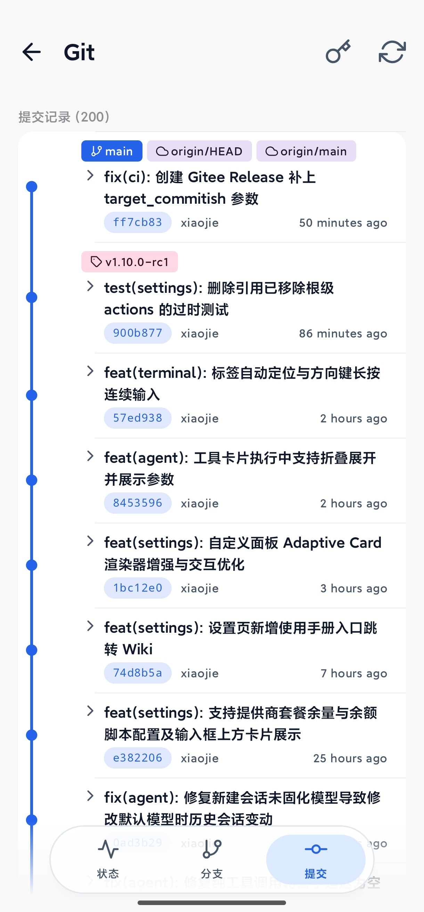
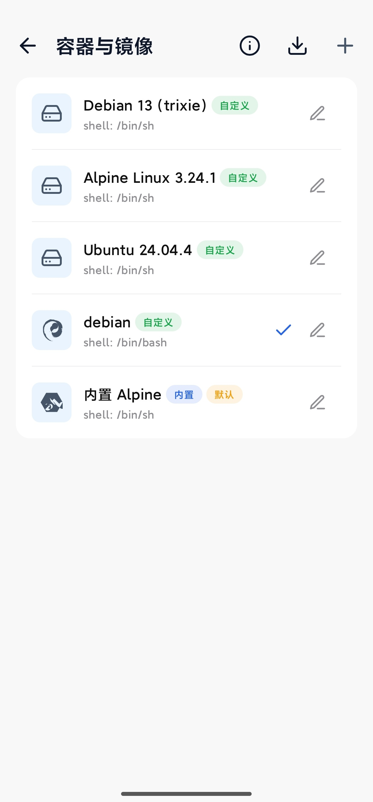
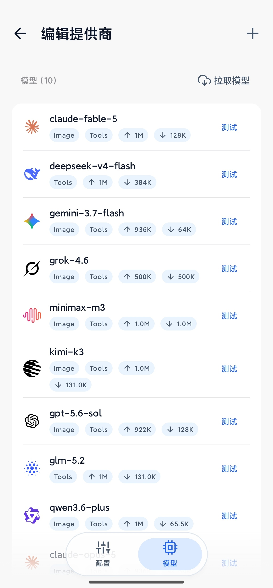
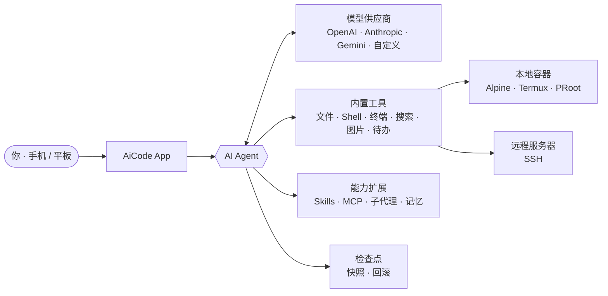

<div align="center">


# AiCode

**把完整的 AI 编程工作站装进你的手机**

Android 上的通用 AI Coding Agent · Linux 开发环境 · 支持本地与远程 SSH

[中文](README.md) · [English](README.en.md)

<br/>

[](LICENSE)
[](https://github.com/hwsyyds666/AiCode/releases/latest)
[](https://github.com/hwsyyds666/AiCode/releases)
[](https://github.com/hwsyyds666/AiCode/stargazers)
[](https://github.com/hwsyyds666/AiCode/forks)

[快速开始](#快速开始) · [功能特性](#功能特性) · [使用文档](https://aicode.murk.top) · [下载](https://github.com/hwsyyds666/AiCode/releases/latest) · [反馈](#反馈与贡献)

</div>

<br/>

> **关于本仓库**
> 本项目是基于原作者 [jieapi/AiCode](https://github.com/jieapi/aicode) 的二次开发分支，在原项目基础上新增了 **Liquid Glass 液态玻璃 UI**、**AI 待办任务显示位置偏好**、**悬浮玻璃标题栏**等功能，并修复了容器通道与性能问题。
> 原项目版权归原作者所有，本分支遵循相同的 [GPL-3.0](LICENSE) 协议开源。

---

## 预览

<table>
  <tr>
    <td align="center" width="50%">
      
      <br/><b>AI 对话</b><br/><sub>流式输出 · 实时 Markdown 渲染</sub>
    </td>
    <td align="center" width="50%">
      
      <br/><b>Git 集成</b><br/><sub>状态 · 分支 · 提交历史 · 差异</sub>
    </td>
  </tr>
  <tr>
    <td align="center" width="50%">
      
      <br/><b>容器与镜像</b><br/><sub>内置 Alpine · 自定义 rootfs</sub>
    </td>
    <td align="center" width="50%">
      
      <br/><b>模型管理</b><br/><sub>多供应商 · 多 Key 轮换</sub>
    </td>
  </tr>
</table>

---

## 简介

AiCode 是运行在 Android 上的通用 AI Coding Agent。它把一套完整的 Linux 开发环境装进手机：内置 Alpine Linux 容器与终端，AI Agent 可以读写文件、执行 Shell 命令、运行构建工具，**写代码、调试到构建，全程在手机本地完成**。

也可以把执行后端切换为远程 SSH 服务器，让手机变成远程项目的移动工作站。

上手无需任何准备：装上 App，在「AI 供应商」里配好模型，就可以直接开发 —— 不用电脑，也不用自己搭建环境。AiCode **不内置模型、不绑定供应商**，模型、密钥与端点完全由你自己掌控。

## 核心亮点

<table>
  <tr>
    <td width="33%" valign="top">
      <h4>📱 手机即工作站</h4>
      内置 Alpine Linux 容器与多标签终端，开发、调试、构建都在本机完成
    </td>
    <td width="33%" valign="top">
      <h4>🌐 本地 / 远程双后端</h4>
      本地容器与远程 SSH 一键切换，命令、文件、终端都作用于所选环境
    </td>
    <td width="33%" valign="top">
      <h4>⏪ 快照回退</h4>
      Agent 改代码前自动记录检查点，一键回滚代码、对话，或两者同时回滚
    </td>
  </tr>
  <tr>
    <td valign="top">
      <h4>🌿 可视化 Git</h4>
      状态、分支、提交历史、差异与标签一目了然，支持暂存、回退与凭据配置
    </td>
    <td valign="top">
      <h4>🧩 Skills · MCP · 子代理</h4>
      可复用的技能、可扩展的 MCP 工具、可并行的子代理，能力按需生长
    </td>
    <td valign="top">
      <h4>🔑 模型无关</h4>
      兼容 OpenAI / Anthropic / Gemini 三类协议，也支持自定义供应商
    </td>
  </tr>
</table>

## 工作原理



## 本分支新增

相比原项目，这个分支专注于视觉体验与稳定性：

| 新增 / 改进 | 说明 |
| :-- | :-- |
| 🪟 **Liquid Glass 液态玻璃 UI** | 基于 [PrismalAGSL](https://github.com/styropyr0/PrismalAGSL)，带来折射、色散与渐变玻璃效果 |
| 📌 **AI 待办任务显示位置偏好** | 可自定义 AI 待办清单在界面中的显示位置 |
| 🎐 **悬浮玻璃标题栏** | 与液态玻璃风格统一的悬浮式标题栏 |
| 🛠️ **稳定性修复** | 修复容器通道问题，并优化性能 |

## 功能特性

<details open>
<summary><b>🤖 AI Agent</b></summary>
<br/>

- **完整的工具集** — 文件读写与编辑、Shell 执行、后台终端、代码与网页搜索、图片识别、待办清单；流式输出并实时渲染 Markdown，长对话自动压缩上下文
- **子代理并行** — 主会话可派生独立上下文的子代理，在后台并行调研、审查或对比方案而不阻塞对话；内置只读的 Explore 子代理，也可自定义模型、工具集与提示词
- **检查点与撤销** — Agent 改代码前自动记录文件快照，对话中可一键回滚代码、对话或两者
- **技能与自动记忆** — 支持全局 / 项目级技能（Skills）与长期记忆，AI 可跨会话复用经验与项目约定
- **MCP 协议** — 支持连接本地（stdio）与远程（HTTP）MCP 服务器，动态扩展 AI 工具能力
- **工具授权与自定义提示词** — 逐工具配置授权规则；系统提示词支持用户覆盖，且 App 升级不丢失

</details>

<details>
<summary><b>🔀 三种运行模式</b></summary>
<br/>

| 模式 | 定位 | 行为 |
| :-- | :-- | :-- |
| **BUILD** | 正常开发 | 按你配置的工具授权规则执行 |
| **PLAN** | 只读规划 | 工具层直接拦截写操作，只做分析与方案 |
| **AUTO** | 免授权全放行 | 所有操作自动通过，仅建议在完全信任的环境中使用 |

按信任程度切换 AI 的权限，该放手时放手，该谨慎时谨慎。

</details>

<details>
<summary><b>🧠 模型与供应商</b></summary>
<br/>

- **模型无关** — 不内置模型、不绑定供应商，模型、密钥与端点自行配置
- **协议兼容** — 兼容 OpenAI / Anthropic / Gemini 三类协议，内置多家官方预设，也支持自定义供应商；模型列表与单价可自定义
- **多 Key 轮换** — 同一供应商可配置多个 Key，按顺序或轮询自动轮换；思考强度可调

</details>

<details>
<summary><b>💻 开发环境</b></summary>
<br/>

- **内置终端与容器** — 基于 Termux 与 PRoot 的本地 Linux 容器，内置 Alpine 镜像，支持导入自定义 rootfs、挂载宿主目录；终端多标签、可后台常驻
- **远程 SSH 模式** — 把远程服务器作为执行后端，命令、文件与终端都作用于远端项目
- **文件树与代码编辑器** — 缩进式文件树，点开即进全屏编辑器，支持主流语言语法高亮与 Markdown 预览；AI 回复里的 `文件:行号` 链接可直接跳转，本地与远程 SSH 工作区都支持
- **Git 集成** — 可视化管理状态、分支、提交历史、差异与标签，支持暂存与回退改动、署名与凭据配置
- **工作区同步** — 支持 SFTP / FTP 同步，内置 FTP 服务端，方便从电脑端管理文件

</details>

<details>
<summary><b>✨ 使用体验</b></summary>
<br/>

- **平板与大屏适配** — 按窗口宽度自适应：宽屏常驻侧边栏，聊天旁并排显示代码或终端；变窄时退回单栏
- **Token 统计** — 按渠道与模型统计用量、估算费用，可下钻查看调用明细
- **外观与语言** — 明暗主题、预设配色、莫奈取色、自定义背景图，中英双语界面
- **网络代理** — 全局代理与供应商级代理可分别配置
- **备份与还原** — 加密导出 / 导入供应商配置、凭据、聊天历史与工作区文件

</details>

## 快速开始

**系统要求**：Android 8.0+（API 26），arm64-v8a / x86_64

**1. 下载安装**

前往 [GitHub Releases](https://github.com/hwsyyds666/AiCode/releases/latest) 下载对应安装包：

| 安装包 | 适用设备 |
| :-- | :-- |
| `armsolo` | 真机（arm64-v8a） |
| `x86solo` | 模拟器（x86_64） |
| `universal` | 通用包，不确定选哪个时使用 |

**2. 三步上手**

1. 进入「**设置 → AI 供应商**」，配置你的模型、密钥与端点
2. 在「**容器与镜像**」中选择使用本地容器或远程 SSH
3. **新建会话**，开始对话

> 📖 更详细的快速上手、使用手册与进阶教程，请查看 [在线文档](https://aicode.murk.top)（与 App 内置文档同源）。

## 从源码构建

```bash
git clone https://github.com/hwsyyds666/AiCode.git
cd AiCode
./gradlew assembleDebug
```

构建产物位于 `app/build/outputs/apk/` 目录。需要预先安装 JDK 与 Android SDK。

## 项目结构

```text
AiCode
├── app/                # Android 主应用
├── terminal-emulator/  # 终端模拟器核心（基于 Termux）
├── terminal-view/      # 终端视图组件（基于 Termux）
├── prismalrepo/        # PrismalAGSL 液态玻璃库（本地 Maven 仓库）
├── docs/               # 图标与截图等文档资源
└── docs-site/          # 在线文档站点源码
```

## Star History

如果 AiCode 对你有帮助，欢迎点一个 ⭐ Star，让更多开发者看到这个项目。

[](https://www.star-history.com/#hwsyyds666/AiCode&Date)

## 反馈与贡献

- 🐞 **Bug 反馈**：到 [Issues](https://github.com/hwsyyds666/AiCode/issues) 提交，请附上复现步骤、设备型号与系统版本，便于定位
- 💡 **功能建议**：想加新功能或改进，欢迎先在 [Issues](https://github.com/hwsyyds666/AiCode/issues) 讨论
- 🔧 **贡献代码**：欢迎提交 [Pull Request](https://github.com/hwsyyds666/AiCode/pulls)
- 💬 **交流群**：原项目 [AiCode QQ 交流群](https://qm.qq.com/q/ByvqODJdIs)（群号：1107110698），可交流使用心得

### 贡献者

<a href="https://github.com/hwsyyds666/AiCode/graphs/contributors">
  
</a>

## 致谢

- **[jieapi/AiCode](https://github.com/jieapi/aicode)** — 原作者项目，本分支的基础
- [OpenCode](https://github.com/anomalyco/opencode) — 终端 AI 编码工具，本项目的核心灵感来源
- [Termux](https://github.com/termux/termux-app) — Android 终端模拟器，提供了终端组件与 PRoot 方案
- [Kelivo](https://github.com/Chevey339/kelivo) — 跨平台 LLM 聊天客户端，AI 对话界面设计参考
- [PrismalAGSL](https://github.com/styropyr0/PrismalAGSL) — AGSL 液态玻璃效果库

## 开源协议

本项目基于 [GPL-3.0](LICENSE) 协议开源，第三方组件的版权声明详见 [NOTICE](NOTICE)。

<div align="center">

<sub>Made with ❤️ on Android</sub>

</div>
