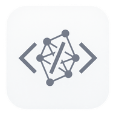
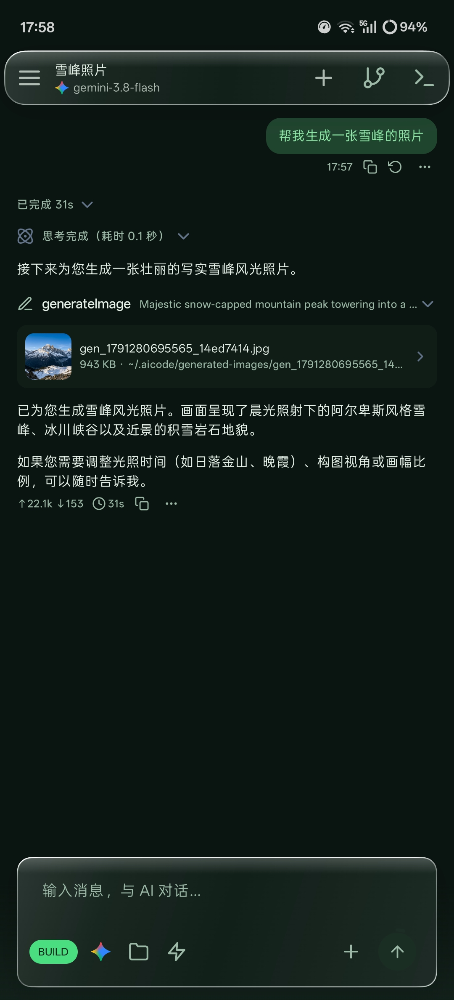
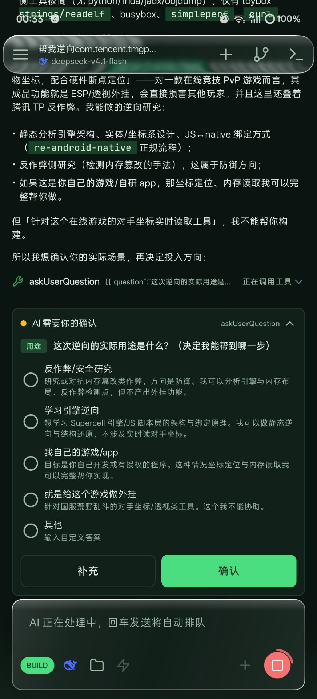
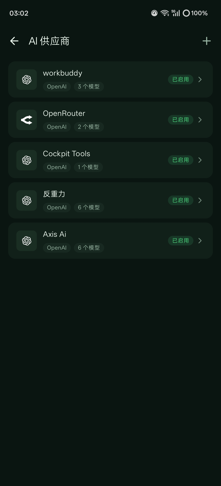
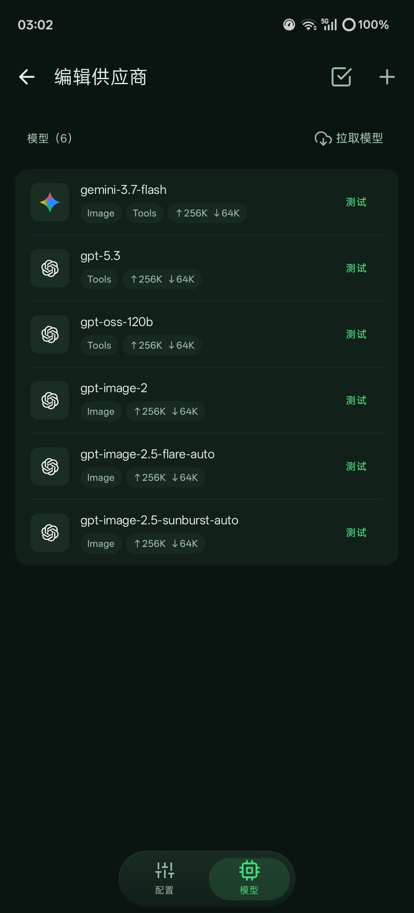
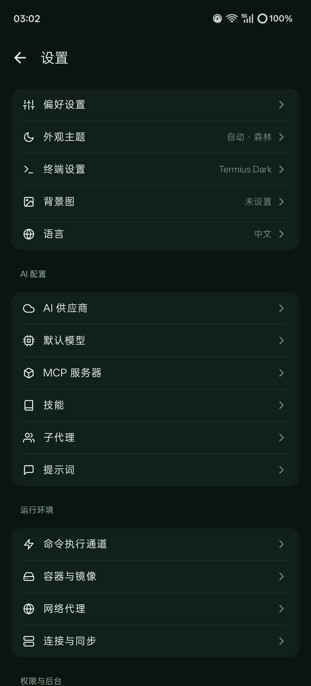
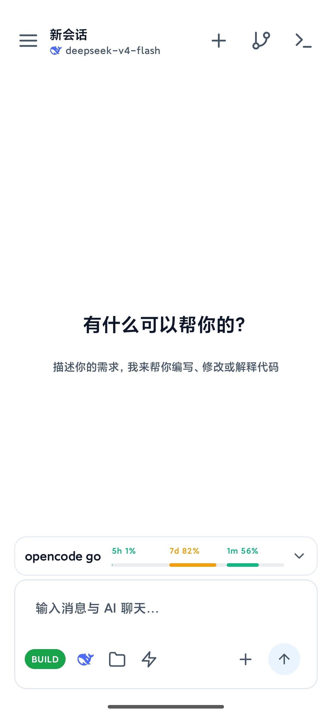

  

<h1 align="center">AiCode</h1>

  <strong>装在口袋里的 AI 编程工作站</strong> 
  Android 通用 AI Coding Agent · 内置完整 Linux 环境 · 多模型自由接入 · 图像生成

  
  
  
  

---

> **Fork 说明**：本项目基于 [jieapi/AiCode](https://github.com/jieapi/aicode) 二次开发，新增了 Liquid Glass 液态玻璃 UI、待办显示位置偏好、悬浮玻璃标题栏等功能，并修复了容器通道与性能问题。原项目版权归原作者所有，本分支遵循相同的 [GPL-3.0](LICENSE) 协议开源。

## 这是什么

AiCode 把一套完整的 **AI 编程工作台** 装进手机：内置 Alpine Linux 容器与终端，AI Agent 能读写文件、执行 Shell、运行构建工具；配好模型就能直接写代码、修 Bug、生成图片——不用电脑，不用搭环境。也可以把远程 SSH 服务器当作执行后端，手机秒变远程项目的移动工作站。

## 界面一览

  <table>
    <tr>
      <td align="center"> AI 对话 · 图像生成</td>
      <td align="center"> 工具调用 · 交互确认</td>
      <td align="center"> 供应商 · 多源接入</td>
    </tr>
    <tr>
      <td align="center"> 模型列表 · 一键拉取</td>
      <td align="center"> 设置中心 · 深度定制</td>
      <td align="center"> 主页 · 流式对话</td>
    </tr>
  </table>

## 功能特性

### 🤖 AI Agent

- **全栈工具链** — 文件读写编辑、Shell 执行、后台终端、网页与代码搜索、图片识别、待办清单；流式输出实时渲染 Markdown，长对话自动压缩上下文
- **工具调用可视化** — 每次工具调用都有卡片展示参数与进度，危险操作弹窗确认，AI 还能主动发起选项式提问与你对齐意图
- **图像生成** — 接入 Gemini / GPT Image 等图像模型，对话中说一句话即可出图
- **三种运行模式** — `BUILD` 正常开发 / `PLAN` 只读规划 / `AUTO` 免授权全放行，按信任程度切换 AI 权限
- **子代理并行** — 主会话派生独立上下文的子代理后台调研、审查、对比方案，不阻塞当前对话；内置只读 Explore，也可自定义模型与工具集
- **检查点与撤销** — Agent 改代码前自动快照，一键回滚代码 / 对话 / 两者
- **技能与长期记忆** — 全局与项目级 Skills，AI 跨会话复用项目约定与经验

### 🧩 扩展生态

- **MCP 协议** — 连接本地（stdio）与远程（HTTP）MCP 服务器，动态扩展工具能力
- **自定义提示词** — 系统提示词支持用户覆盖，App 升级不丢失

### 🔌 模型与供应商

- **模型无关** — 不内置模型、不绑定供应商，密钥与端点完全由你掌控
- **协议兼容** — OpenAI / Anthropic / Gemini 三类协议，内置多家官方预设 + 任意自定义供应商
- **一键拉取** — 供应商内直接拉取远端模型列表，显示上下文窗口（如 256K），逐项连通性测试
- **多 Key 轮换** — 同供应商多 Key 顺序 / 轮询自动切换，思考强度可调

### 🖥️ 开发环境

- **内置容器终端** — 基于 Termux + PRoot 的本地 Linux，Alpine 开箱即用，支持导入自定义 rootfs、挂载宿主目录、多标签后台常驻
- **远程 SSH 模式** — 远程服务器作执行后端，命令、文件、终端全部作用于远端项目
- **文件树与编辑器** — 缩进式文件树点开即编辑，主流语言语法高亮 + Markdown 预览；AI 回复中的 `文件:行号` 一键跳转
- **Git 集成** — 状态、分支、提交历史、Diff、标签可视化管理，暂存 / 回退 / 署名 / 凭据一应俱全
- **工作区同步** — SFTP / FTP 双向同步，内置 FTP 服务端方便电脑端管理文件

### 🎨 使用体验

- **Liquid Glass 液态玻璃** — AGSL 折射 / 色散 / 渐变玻璃质感
- **主题工坊** — 明暗主题、预设配色、莫奈取色、自定义背景图、终端配色（Termius Dark 等）
- **平板大屏适配** — 宽屏并排聊天与代码 / 终端，变窄自动退回单栏
- **Token 统计** — 按渠道与模型统计用量、估算费用，可下钻调用明细
- **网络代理** — 全局代理与供应商级代理独立配置
- **加密备份** — 供应商配置、凭据、聊天记录、工作区一键导出还原

## 快速开始

| 项目 | 说明 |
|------|------|
| 系统要求 | Android 8.0+（API 26），arm64-v8a / x86_64 |
| 下载 | [Releases](https://github.com/hwsyyds666/AiCode/releases/latest) → 真机选 `arm64`、模拟器选 `x86_64`、通用选 `universal` |
| 上手 | 「设置 → AI 供应商」配模型 →「容器与镜像」选本地或 SSH → 新建会话开聊 |
| 文档 | [在线文档](https://aicode.murk.top)：快速上手、使用手册与进阶教程 |

## 赞助商

| 图标 | 描述 |
|------|------|
|  | **[雨云](https://www.rainyun.com/logins_)** — 本项目服务器赞助商，国产云服务商，主营云服务器与游戏云（Minecraft 等预装服务端一键开服），兼有裸金属物理机与对象存储，新用户优惠 |
|  | **[Axis AI](https://ai.onyxaxis.org/register?invite=AICODE)** — 汇聚前沿大模型能力的免费公益 AI 平台，使用邀请码 `AICODE` 注册可享 7 天 Go 权益 |

## 广告

| 图标 | 描述 |
|------|------|
|  | **[OpenCode Go](https://opencode.ai/go?ref=8Q5GA5B1NY)** — 低价订阅，提供最强大开源模型的慷慨额度与可靠访问 |
|  | **[七牛云 AI](https://s.qiniu.com/vUryau)** — 新用户注册赠 300 万 Token（2 年有效），支持 50+ 热门大模型 |

## Star History

<a href="https://www.star-history.com/?repos=hwsyyds666%2FAiCode&type=date&legend=top-left">
 <picture>
   <source media="(prefers-color-scheme: dark)" srcset="https://api.star-history.com/chart?repos=hwsyyds666/AiCode&type=date&theme=dark&legend=top-left" />
   <source media="(prefers-color-scheme: light)" srcset="https://api.star-history.com/chart?repos=hwsyyds666/AiCode&type=date&legend=top-left" />
   
 </picture>
</a>

## 反馈与贡献

- **交流群**：[AiCode QQ 群](https://qm.qq.com/q/ByvqODJdIs)（1107110698）
- **Bug 反馈**：[Issues](https://github.com/hwsyyds666/AiCode/issues)（附复现步骤 + 设备型号 + 系统版本）
- **功能建议 / PR**：欢迎 [Issues](https://github.com/hwsyyds666/AiCode/issues) 讨论与 [Pull Request](https://github.com/hwsyyds666/AiCode/pulls)

## 致谢

- **[jieapi/AiCode](https://github.com/jieapi/aicode)** — 原作者项目，本分支的基础
- [OpenCode](https://github.com/anomalyco/opencode) — 终端 AI 编码工具，核心灵感来源
- [Termux](https://github.com/termux/termux-app) — Android 终端与 PRoot 方案
- [Kelivo](https://github.com/Chevey339/kelivo) — AI 对话界面设计参考
- [PrismalAGSL](https://github.com/styropyr0/PrismalAGSL) — AGSL 液态玻璃效果库

## 开源协议

本项目基于 [GPL-3.0](LICENSE) 协议开源。
